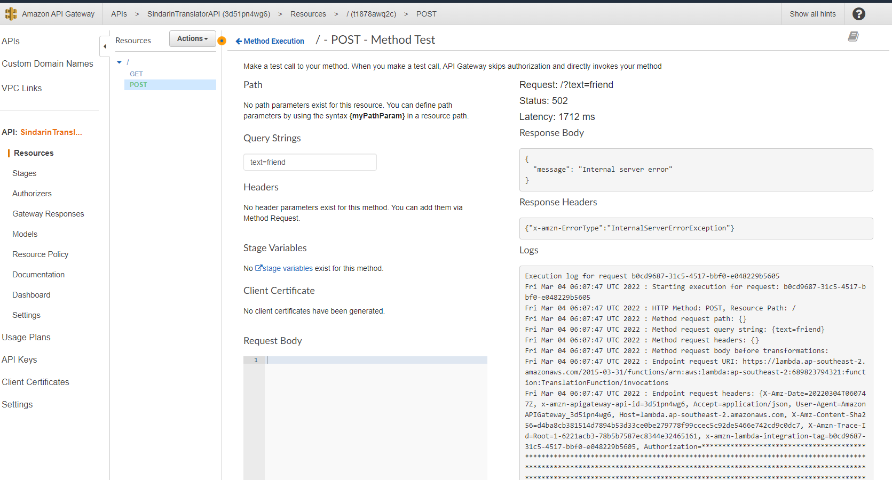
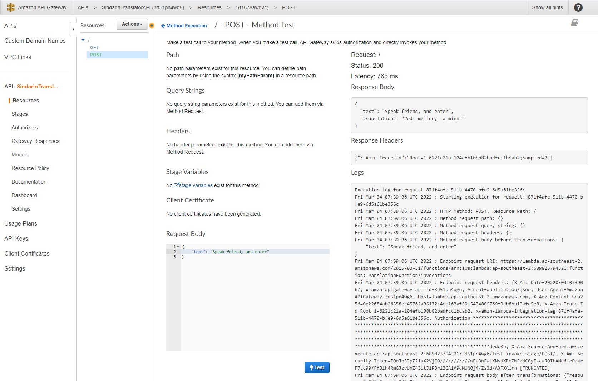
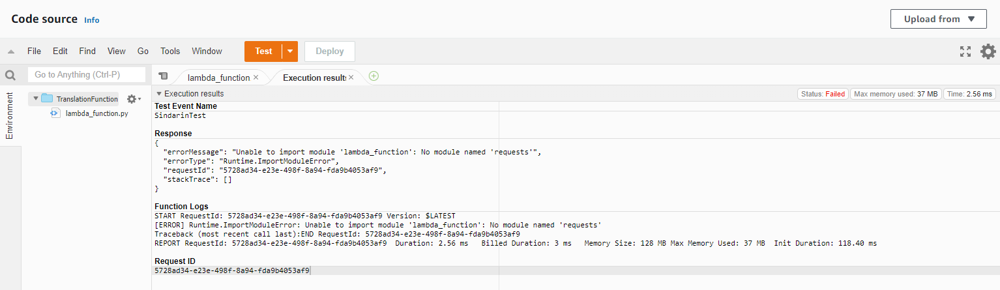
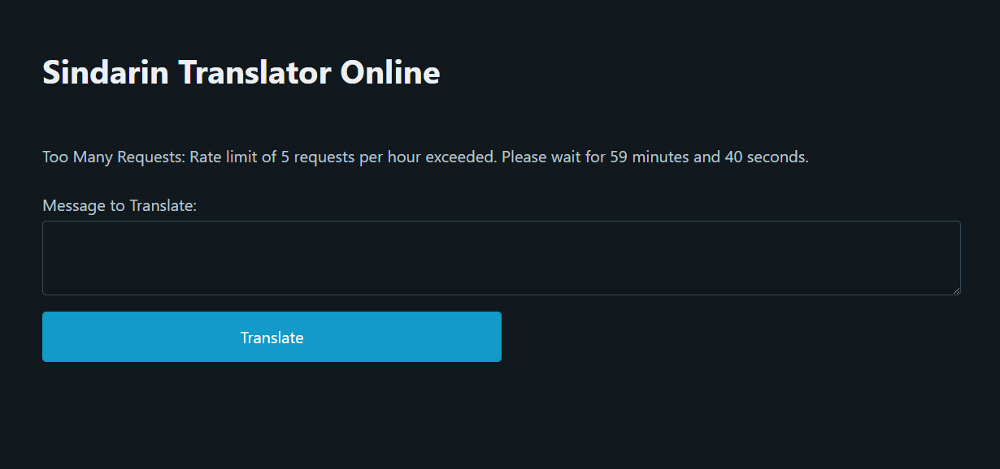

CCC-2022 T4A2 - Full Stack Application - Karl Alberto

---

___N.B. Edited/updated from original prject and documentation [here](https://github.com/Kei-Eff/T4A2_Final) due to shift in tech stack.___

# Sindarin Translator Online

## Description

_Sindarin Translator Online_ aims to provide a web interface for the terminal application I created in Term 2 (2021) for the CCC course (T2A3). You can find more details about that project [here](https://github.com/Kei-Eff/sindarin-translator).

Documentation and Development updates are available via Trello [here](https://trello.com/b/5FlPl44f/t4a2-sindarin-translator-online), along with screenshots below.

 

## Main Functionality/Features

* English-to-Sindarin (Tolkien _Elvish_) translations
* Easy to use, responsive website
* Minimal design: text in, text out
* Cache for most requested translations (to limit API calls)

## Future Improvements/Additional Features

* More Middle Earth language options:
    * English-to-_Quenya_
    * English-to-_Orcish_
* Output text in _Tengwar_ (Elvish) script

 

## Target Audience

* Fans of J.R.R. Tolkien's written works, and the 'Middle Earth'/'Lord of the Rings' universe.
* Fans of the 'Lord of the Rings' and 'The Hobbit' movie franchises.
* Fans who are interested in the upcoming 'Rings of Power' _Amazon Prime Video_ series.
* Fans of _Conlangs_ (Constructed Languages) who want a phonetic representation of the _Elvish Sindarin_ language.
* Linguists and linguistics students who want to study how Tolkien created his own languages.
* Fans of video games set in Middle Earth.

 

## Tech Stack

* HTML5
* CSS ([Pico.css](https://picocss.com/))
* Python 3
* Flask
* Github
* AWS Identity and Access Manager
* AWS EC2
* AWS Lambda
* Amazon DynamoDB
* AWS Parameter Store

 

## Progress Updates: Trello

_N.B. Updates from February 2022 can now be found [here](./docs/trello_updates_feb_2022.md)._

Priority labels as follow:

    * Low Priority
    * Priority (default)
    * High Priority
    * Urgent
    * Ongoing
    * Nice to Have
    * CRITICAL
    * Postponed

### 1 March 2022

Tackling page layout:

___Trello highlights between 1-6 March can be found in the original [project repo](https://github.com/Kei-Eff/T4A2_Final).___

### 7 March 2022

Updated tech stack and app direction; Trello tasks updated with dates, new list and labels (for "Postponed" tasks). No longer serverless due to time constraints. Moving back to `Flask` on _EC2_ deployment:

### 8 March 2022

Readme updates; created `Table` in _Amazon DynamoDB_:

---

## Testing Progress

### 4 March 2022

API Gateway; and Lambda API endpoint testing:

### 8 March 2022

Testing API Error Message on page:

---

Karl Alberto | 2022